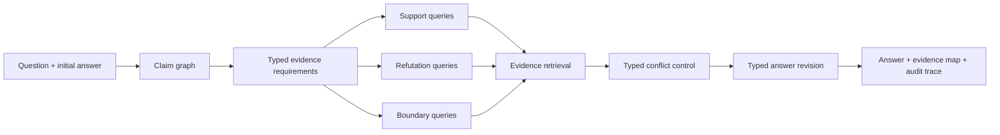

# FAR: Falsification-Augmented Retrieval

[](https://www.python.org/)
[](LICENSE)
[](docs/COMPLETION_AUDIT.md)

**Ask What Could Be Wrong: Falsification-Guided Retrieval for Self-Correcting
Language Agents**

FAR asks a retrieval-augmented agent a deliberately uncomfortable question:
**what evidence would make its current answer wrong?** Instead of accumulating
only supporting passages, FAR turns possible failure modes into typed,
retrievable evidence requirements and uses the resulting conflicts to revise
the answer.

This repository contains the method, FalsiRAG-Bench candidate data, experiment
and evaluation infrastructure, independent-annotation workflow, blind-test
handoff tooling, and an anonymous AAAI-27 paper draft. The complete research
plan is in [PROJECT_PROPOSAL.md](PROJECT_PROPOSAL.md).

> [!IMPORTANT]
> This is a research artifact, not a finished publication result. The current
> 300 benchmark labels are machine-seeded. They are useful for development but
> cannot replace two independent human annotations, adjudication, or externally
> held blind testing. The repository fails closed on those distinctions.
>
> A separate `single_author_machine_audited_diagnostic` profile is available
> when no second annotator exists. It audits construction-derived labels with
> LLM and deterministic weak signals, validates the complete local dev suite,
> and preserves a gold-free local test bundle. Its complete public evidence is
> tracked under [diagnostics/solo_v1](diagnostics/solo_v1). It does not claim
> human gold or external blindness.

## Why FAR

FAR does **not** claim that answer-conditioned re-retrieval or counter-evidence
search is new by itself. Its intended contribution is a shared typed-conflict
control layer that connects:

1. a dependency-aware claim graph;
2. positive evidence requirements;
3. support, refutation, and boundary queries;
4. typed conflict detection; and
5. type-specific revision with an auditable before/after trace.



## Current research status

| Area | Current state |
|---|---|
| FAR method | Implemented and covered by unit/integration tests |
| FalsiRAG-Bench | 300 balanced candidate samples and 175 documents; construction validator passes |
| Labels | 300/300 construction-derived; machine audit complete (178 confirmed, 122 disputed); strict human track pending |
| Development experiments | Corrected Qwen3.5 9B FAR, six baselines, and four ablations complete on dev; diagnostic only |
| Formal model matrix | DeepSeek V4-Flash and Qwen3.7 Plus runs await rotated credentials and adjudicated labels |
| Blind test | Gold-free bundle, custody protocol, return validator, and trusted scorer implemented; external execution pending |
| Solo study profile | Automated readiness passes; 69-file, 11-method diagnostic evidence bundle is tracked and self-verifying |
| Paper | Anonymous AAAI-27 draft and checklist compile; final empirical cells and human review pending |

The authoritative requirement-by-requirement status is
[docs/COMPLETION_AUDIT.md](docs/COMPLETION_AUDIT.md). Diagnostic scores must not
be copied into the paper's final table.

## Installation

Requirements:

- Python 3.10 or newer;
- [uv](https://docs.astral.sh/uv/);
- Git;
- optional local VeraRAG checkout for its provider/retrieval adapters.

Clone and install the standalone offline path:

```bash
git clone https://github.com/xiaweiyi713/FAR.git
cd FAR
uv sync --extra dev --extra eval
uv run python examples/offline_demo.py
```

The offline demo and deterministic protocol do not require API keys. To use the
formal dense/reranking/NLI stack, install the experiment dependencies and, when
available, a sibling VeraRAG checkout:

```bash
uv sync --extra dev --extra eval --extra experiment
uv pip install --no-deps -e ../VeraRAG
```

Formal configurations fail rather than silently degrading if dense retrieval,
reranking, or NLI assets are unavailable.

## Quick validation

```bash
uv run falsirag-validate-bench
uv run falsirag-scan-secrets --json
uv run ruff check .
uv run mypy far bench baselines eval experiments tests
uv run pytest
```

Run a small, balanced, dependency-free diagnostic suite:

```bash
uv run falsirag-suite \
  --config experiments/configs/offline_smoke.yaml \
  --output-dir outputs/smoke_suite \
  --limit 10 \
  --baseline vanilla_rag \
  --ablation minus_typed_conflict \
  --resamples 200
```

Limited runs are marked `partial`; artifacts derived from them remain
`diagnostic_only`. The held-out `test` split is rejected unless the caller
explicitly supplies `--allow-test`.

## Method output

`FARPipeline.run(question, initial_answer)` returns:

- a validated acyclic claim graph;
- typed evidence requirements for every claim;
- support/refutation/boundary query and retrieval traces;
- a claim-to-evidence map and typed conflicts;
- a revised answer; and
- an explicit before/after revision trace.

Configured LLMs can participate in claim decomposition, typed-query generation,
and revision realization. Invalid structured output falls back to the
deterministic typed protocol; provider failures remain visible in run records.

The optional VeraRAG adapter supports OpenAI, Anthropic, Ollama, DashScope,
ZhipuAI, and DeepSeek, together with BM25, dense, FAISS, hybrid RRF, and an
optional CrossEncoder reranker.

## Benchmark

FalsiRAG-Bench v0.2.0-candidate contains five balanced categories:

- temporal shift;
- numerical conflict;
- entity confusion;
- causal overclaim; and
- multi-source conflict.

The frozen candidate build has 300 samples, 175 corpus documents, no
cross-split dependency-group leakage, and 0.91 lexical counter-evidence
recall@10 when pooling the three query families. This is a corpus-construction
check, not a FAR performance result.

`bench/manifest.json` intentionally records `publication_ready: false` until
two independent reviewers, a separate adjudicator, agreement checks, and the
external blind-test protocol are complete. See [bench/CARD.md](bench/CARD.md)
for sources, licenses, construction, and limitations.

For a single-author diagnostic study, build a fingerprinted machine-audit
record:

```bash
uv run falsirag-machine-consensus \
  --data-dir bench \
  --preannotation-dir outputs/remote_machine_annotation/qwen25_preannotations \
  --weak-label-dir outputs/remote_machine_annotation/rules_weak_labels \
  --output-dir outputs/machine_consensus_v1 \
  --overwrite
```

Then validate the complete automated profile:

```bash
uv run falsirag-solo-readiness \
  --data-dir bench \
  --machine-report outputs/machine_consensus_v1/machine_consensus_report.json \
  --suite-dir outputs/remote_qwen_six_baseline_suite \
  --blind-bundle-dir outputs/handoff/falsirag_blind_test_technical_v1 \
  --output outputs/solo_readiness.json
```

This does not weaken `falsirag-submission-readiness`; the strict AAAI evidence
gate remains separate.

The repository also tracks the complete 4.5 MB diagnostic evidence bundle,
including all 11 methods' predictions, scores, reports, figures, and the
300-row machine audit. Verify it without rerunning a model:

```bash
uv run falsirag-solo-release verify diagnostics/solo_v1
```

The verifier rejects missing, extra, modified, or symlinked files and rejects
any manifest that upgrades the bundle to human gold or publication-ready
evidence. To rebuild the bundle from local ignored outputs, use
`falsirag-solo-release build`; the exact command is documented in the bundle
README.

## Reproducibility and release gates

The repository records benchmark fingerprints, config hashes, implementation
hashes, Git revision/dirty state, run signatures, resumable checkpoints, paired
bootstrap intervals, and McNemar tests.

Run all repository-controlled checks on a clean commit:

```bash
bash scripts/release_check.sh
```

Without an evidence override, this runs in deliberately incomplete template
mode. A true final release must use a real ignored evidence file:

```bash
FAR_SUBMISSION_EVIDENCE=submission/evidence.json bash scripts/release_check.sh
```

The final command fingerprints nine package, audit, evidence, and paper
artifacts before running the readiness audit. It succeeds only when the human
annotation, three-model dev matrix, external blind returns, trusted scoring,
release archive, and independent paper review all pass.

Never commit API keys. A previously exposed key must be rotated before use.

## Repository map

```text
far/          FAR claim, evidence, query, conflict, and revision pipeline
bench/        Candidate benchmark, corpus, schemas, builders, and annotation tools
baselines/    Six transparent comparison systems
eval/         Metrics, confidence intervals, and paired significance tests
experiments/  Runners, configs, result validation, scoring, and release gates
paper/        AAAI-27 manuscript, supplement, style files, and checklist
submission/   Non-secret evidence and attestation templates
docs/         Architecture, protocols, experiment plan, and completion audits
tests/        Unit, integration, provenance, and fail-closed regression tests
```

## Documentation

- [Architecture](docs/ARCHITECTURE.md)
- [Reproduction guide](docs/REPRODUCING.md)
- [Experiment plan](docs/EXPERIMENT_PLAN.md)
- [Evaluation definitions](docs/EVALUATION.md)
- [Automatic annotation assistance](docs/AUTO_ANNOTATION.md)
- [Independent human annotation protocol](docs/HUMAN_ANNOTATION_PROTOCOL.md)
- [External blind-test handoff](docs/BLIND_TEST_HANDOFF.md)
- [Role-by-role final action packet](docs/EXTERNAL_ACTION_PACKET.md)
- [Proposal traceability](docs/PROPOSAL_TRACEABILITY.md)
- [Completion audit](docs/COMPLETION_AUDIT.md)
- [Development log](docs/DEVELOPMENT_LOG.md)
- [Anonymous paper draft](paper/main.tex)

## License

FAR code and controlled synthetic summaries are released under the
[MIT License](LICENSE). VeraRAG adapters reuse MIT-licensed code through an
optional local dependency. Upstream datasets and source materials retain their
own terms; the separately imported FEVER candidate slice records CC-BY-SA-3.0
and GPL-3.0 provenance in its accompanying license file.
