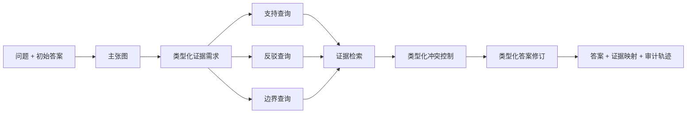

# FAR：证伪增强检索

[](https://www.python.org/)
[](LICENSE)
[](docs/COMPLETION_AUDIT.md)
[](https://github.com/xiaweiyi713/FAR/actions/workflows/ci.yml)

**Ask What Could Be Wrong: Falsification-Guided Retrieval for Self-Correcting
Language Agents**

FAR 会向检索增强智能体提出一个刻意“唱反调”的问题：**什么证据能够证明当前答案是错的？**
它不再只积累支持性段落，而是把可能的错误类型转化为可检索的类型化证据需求，再根据发现的冲突修正答案。

本仓库包含 FAR 方法、FalsiRAG-Bench 候选数据、实验与评测基础设施、独立标注流程、盲测交接工具，
以及匿名 AAAI-27 论文草稿。完整研究企划见 [PROJECT_PROPOSAL.md](PROJECT_PROPOSAL.md)。

> [!IMPORTANT]
> 当前 300 条基准标签由构造规则和机器信号生成，不能替代两名真人的独立标注、仲裁或外部保管盲测。
> 根据单作者现实约束，仓库现提供一个明确放宽的机器审计论文 profile：它允许把完整 Qwen dev 诊断写入论文，
> 但强制收窄到 typed-vs-untyped 机制主张，并披露所有负消融、非真人金标、非外部盲测和单模型限制。
>
> 在找不到第二位标注者时，可以使用独立的 `single_author_machine_audited_diagnostic`
>（单作者机器审计诊断）路径。它使用 LLM 与确定性弱监督信号审计构造标签，验证完整本地开发集实验，
> 并保留不含金标的技术测试包。完整公开证据位于
> [diagnostics/solo_v1](diagnostics/solo_v1)。派生的
> [122 条人工复核优先级表](reports/solo_human_review_priority.csv)
> 可帮助未来有限的人力优先检查机器争议样本，但它不代表真人金标或外部盲测。
> 宽松论文门禁见 [机器审计论文就绪报告](reports/solo_paper_readiness.md)；严格 AAAI 门禁仍独立保持失败关闭。
>
> 现在另有一条预注册的 **2+4 替代路线**：RAMDocs 外部上游标签验证 +
> DeepSeek/GLM/Meta 跨家族 LLM 陪审团 + 作者盲态仲裁。它正式替代本项目
> 无法完成的真人双标注门禁，但不会被描述为真人 IAA、publication-grade human gold
> 或外部保管盲测。协议见 [2+4 执行规划](docs/PLAN_2PLUS4.md)，执行状态与命令见
> [2+4 执行手册](docs/PLAN_2PLUS4_EXECUTION.md)。
> 当前 RAMDocs dev Round 1 与只改 FAR 最终答案合并层的 dev-only Round 2
> 均已完整运行且均未通过 G-A；第二次失败触发预注册停止规则。陪审团、
> 留出集和多模型投稿包装均未启动，2+4 分支降级为 typed conflict control
> 的适用边界分析。

## 为什么需要 FAR

FAR **不声称**“根据答案再次检索”或“搜索反证”本身是首次提出。它的核心贡献是一个共享的
**类型化冲突控制层**，将以下环节连接起来：

1. 带依赖关系的主张图；
2. 正向的类型化证据需求；
3. 支持、反驳和边界三类查询；
4. 类型化冲突检测；
5. 按冲突类型执行的答案修订，以及可审计的修改前后轨迹。



## 当前研究状态

| 模块 | 当前状态 |
|---|---|
| FAR 方法 | 已实现，并有单元测试和集成测试覆盖 |
| FalsiRAG-Bench | 300 条五类均衡候选样本、175 篇语料文档；构造校验通过 |
| 标签 | 300/300 为构造标签；机器审计确认 178 条、争议 122 条；dev 分层后 typed 优势在 35 条确认与 25 条争议子集方向一致 |
| 开发集实验 | Qwen3.5 9B 上的 FAR、6 个基线和 4 个消融均已完成；typed-vs-untyped 为正，其余消融为混合或负结果 |
| 2+4 外部验证 | RAMDocs dev Round 1：8 方法 × 350 条已完整冻结并通过指纹校验；FAR 与最强 Multi-Query 基线 exact match 均为 0.3114，G-A 失败。Round 2 只重跑 FAR 的最终答案合并层，完整 350 条后 FAR 为 0.3086、冻结 Multi-Query 基线为 0.3114，配对差 -0.0029、95% CI [-0.0314, 0.0286]、McNemar p=1.0；第二次 G-A 失败触发停止规则和论文降级。证据包见 [diagnostics/ramdocs_v2](diagnostics/ramdocs_v2)。 |
| 跨家族陪审团 | 工具已实现，但因 G-A 失败未执行；不存在 jury gold，更不得称为真人 IAA |
| 正式多模型矩阵 | 工具已实现，但按停止规则不运行 jury-gold 矩阵或投稿包装 |
| 盲测 | 无金标测试包、保管协议、回传校验器和可信评分器均已实现；等待外部执行 |
| 单作者研究路径 | 自动验收通过；已跟踪 69 个文件、11 种方法的自校验诊断证据包 |
| 外部迁移 | 已公开冻结的 100 对 FEVER 二分类诊断；0.72 准确率和偏低召回率如实披露了迁移局限 |
| 报告 | 单作者诊断报告、复核优先级 CSV 和项目状态快照位于 [reports/](reports/) |
| 论文 | 单作者机器审计版本已填入完整 dev 表格并收窄主张；宽松门禁通过，严格 AAAI 门禁仍未通过 |

逐项权威状态见 [项目完成度审计](docs/COMPLETION_AUDIT.md)和
[2+4 协议可追溯性矩阵](docs/PLAN_2PLUS4_TRACEABILITY.md)。论文中的诊断结果必须始终带有机器审计、
dev、单模型、非盲测限定，不得改写为真人金标或跨模型结论。

机器生成的当前状态账本见
[项目状态快照](reports/project_status_snapshot.md)。它分别记录：单作者诊断完成、收窄后的机器审计论文
profile 就绪、2+4 替代路线的逐项状态，以及旧的严格真人门禁仍未满足。

## 2+4 零真人预算替代路线

这条路线不是把机器标签“升级命名”为真人标签，而是用两种相互独立的证据降低风险：

1. 在独立发布、带上游答案和文档类型标签的 RAMDocs 上验证完整 FAR；
2. 用 DeepSeek、GLM、Meta 三个与 Qwen/Mistral/Google 系统家族不重叠的陪审员标注；
3. 对无联合多数票或与构造标签冲突的样本，由作者在看不到投票、构造标签和系统输出时仲裁；
4. 间隔至少 14 天后，对争议层按类别抽取 20% 重标，联合自一致率须达到 0.80；
5. 最后才允许一次性运行 FalsiRAG-Bench 与 RAMDocs test。

首轮正式 dev 结果没有通过第 1 步的 G-A：FAR 与最强基线均为 0.3114，
配对差为 0，bootstrap 95% CI 为 [-0.0286, 0.0314]，McNemar p=1.0。
因此第 2–5 步均被停止规则阻断。完整冻结证据见
[RAMDocs dev 证据包](diagnostics/ramdocs_v1/dev)，配对错误分析见
[RAMDocs dev error analysis](diagnostics/ramdocs_v1/error_analysis)。

Round 2 是一次留在 dev 上的方法迭代，只改变 FAR 的最终答案合并层，并继续
复用 Round 1 的冻结初始答案与最强基线分数。它已完整完成 350 条并通过
`experiments.ramdocs_round2 finalize/verify` 的有效性校验，但 G-A 再次失败：
FAR strict exact match 为 0.3086，冻结 Multi-Query 基线为 0.3114，配对差
-0.0029，bootstrap 95% CI 为 [-0.0314, 0.0286]，McNemar p=1.0。按预注册停止规则，
Phase B not run：DeepSeek/GLM/Meta 陪审团、作者盲态仲裁、G-K/G-S、jury
rescoring 和三系统家族矩阵均未运行。Held-out not run：FalsiRAG-Bench 与 RAMDocs
留出集均未评测。RAMDocs 只提供 upstream labels，不是 human inter-annotator
agreement、publication-grade human gold 或外部保管盲测。2+4 分支现在降级为
typed conflict control 的 applicability-boundary 分析。

核心命令：

```bash
# 验证钉死的 RAMDocs 导入
uv run falsirag-build-ramdocs verify

# RAMDocs dev 全套实验（test 默认拒绝）
uv run falsirag-ramdocs-suite run \
  --config experiments/configs/ramdocs_qwen.yaml \
  --data-dir bench/external/ramdocs_v1 \
  --output-dir outputs/ramdocs_dev_v1

# 三陪审员分别运行后计算 G-K
uv run falsirag-jury-consensus \
  --data-dir bench \
  --juror-dir outputs/jury/deepseek \
  --juror-dir outputs/jury/glm \
  --juror-dir outputs/jury/meta \
  --output-dir outputs/jury/consensus

# 查看最终 2+4 论文门；制品不齐时会失败关闭
uv run falsirag-jury-paper-readiness
```

Qwen 的 11 方法预测会在不重新调用模型的情况下分别按完整 jury gold 与
unanimous-only 标签重算；`falsirag-jury-sensitivity` 生成三口径敏感性表。

所有正式制品都绑定 [PLAN_2PLUS4.md](docs/PLAN_2PLUS4.md) 的活动 SHA-256。
任何留出评测前的变更必须使用 `deviation:` 提交并写入开发日志；留出评测后不再允许偏离。

## 安装

环境要求：

- Python 3.10 或更高版本；
- [uv](https://docs.astral.sh/uv/)；
- Git；
- 可选：本地 VeraRAG 仓库，用于模型供应商与检索适配器。

克隆仓库并安装可独立运行的离线路径：

```bash
git clone https://github.com/xiaweiyi713/FAR.git
cd FAR
uv sync --extra dev --extra eval
uv run python examples/offline_demo.py
```

公开 CI 会在 Python 3.10–3.13 上运行测试，并检查格式、静态类型、基准、脱敏密钥扫描和单作者诊断证据，
全程不需要云端凭据或 VeraRAG。CI 还会把构建出的 wheel 与源码包分别安装到隔离环境，验证包内基准、
离线配置和命令行入口。

离线演示与确定性协议不需要 API Key。若要使用正式的稠密检索、重排序和 NLI 栈，请安装实验依赖，
并在有条件时安装同级目录中的 VeraRAG：

```bash
uv sync --extra dev --extra eval --extra experiment
uv pip install --no-deps -e ../VeraRAG
```

如果缺少稠密检索、重排序或 NLI 所需资源，正式配置会直接失败，不会静默降级。

## 快速验证

```bash
uv run falsirag-validate-bench
uv run falsirag-scan-secrets --json
uv run ruff check .
uv run mypy far bench baselines eval experiments tests scripts/package_smoke.py
uv run pytest
```

运行一个小规模、类别均衡且不依赖外部模型的诊断实验：

```bash
uv run falsirag-suite \
  --config experiments/configs/offline_smoke.yaml \
  --output-dir outputs/smoke_suite \
  --limit 10 \
  --baseline vanilla_rag \
  --ablation minus_typed_conflict \
  --resamples 200
```

有限样本运行会标记为 `partial`，由它生成的制品仍保持 `diagnostic_only`。
除非调用者明确提供 `--allow-test`，运行器会拒绝访问留出的 `test` 划分。

## 方法输出

`FARPipeline.run(question, initial_answer)` 返回：

- 经过校验的无环主张图；
- 每条主张的类型化证据需求；
- 支持、反驳、边界查询及检索轨迹；
- 主张到证据的映射和类型化冲突；
- 修订后的答案；
- 明确的修改前后修订轨迹。

配置好的 LLM 可以参与主张分解、类型化查询生成和修订文本生成。无效的结构化输出会回退到确定性类型化协议；
供应商调用失败则会明确记录在运行结果中。

可选 VeraRAG 适配器支持 OpenAI、Anthropic、Ollama、DashScope、智谱和 DeepSeek，
以及 BM25、稠密检索、FAISS、混合 RRF 和可选 CrossEncoder 重排序器。

## 基准数据

FalsiRAG-Bench v0.2.0-candidate 包含五个均衡类别：

- 时间变化（temporal shift）；
- 数值冲突（numerical conflict）；
- 实体混淆（entity confusion）；
- 因果过度推断（causal overclaim）；
- 多来源冲突（multi-source conflict）。

冻结的候选版本包含 300 条样本和 175 篇语料文档，不存在跨划分依赖组泄漏；合并三类查询后，
词法 counter-evidence recall@10 为 0.91。这个数值是语料构造检查，不是 FAR 方法的性能结果。

在两名独立复核者、一名独立仲裁者、一致性检查和外部盲测全部完成前，
`bench/manifest.json` 会始终记录 `publication_ready: false`。数据来源、许可证、构造方式和限制见
[基准数据卡](bench/CARD.md)。

### 单作者机器审计路径

生成带指纹的机器审计记录：

```bash
uv run falsirag-machine-consensus \
  --data-dir bench \
  --preannotation-dir outputs/remote_machine_annotation/qwen25_preannotations \
  --weak-label-dir outputs/remote_machine_annotation/rules_weak_labels \
  --output-dir outputs/machine_consensus_v1 \
  --overwrite
```

验证完整自动化诊断路径：

```bash
uv run falsirag-solo-readiness \
  --data-dir bench \
  --machine-report outputs/machine_consensus_v1/machine_consensus_report.json \
  --suite-dir outputs/remote_qwen_six_baseline_suite \
  --blind-bundle-dir outputs/handoff/falsirag_blind_test_technical_v1 \
  --output outputs/solo_readiness.json
```

这不会降低 `falsirag-submission-readiness` 的要求；严格 AAAI 证据门禁仍然独立存在。

仓库还跟踪了完整的约 4.5 MB 诊断证据包，其中包含 11 种方法的预测、分数、报告、图表，
以及 300 条机器审计记录。无需重新运行模型即可验证：

```bash
uv run falsirag-solo-release verify diagnostics/solo_v1
```

校验器会拒绝缺失、额外、修改过或使用符号链接的文件，也会拒绝任何把诊断包升级为真人金标或正式投稿证据的清单。
若要从本地忽略的输出重建证据包，请使用 `falsirag-solo-release build`；完整命令写在证据包 README 中。

面向读者的单作者成果报告位于
[reports/single_author_diagnostic_report.md](reports/single_author_diagnostic_report.md)。
它是无人协助情况下完整的诊断交付物，并明确区分机器审计证据和严格 AAAI 证据。

无需真人标签、云端凭据、本地忽略输出或外部保管人，即可运行公开单作者诊断门禁：

```bash
bash scripts/solo_diagnostic_check.sh
```

该门禁还会在内存中重建项目状态，并拒绝过期的 JSON 或 Markdown 状态账本。也可以单独运行：

```bash
uv run falsirag-project-status --verify
uv run falsirag-solo-paper-readiness
```

第二条命令会检查论文是否准确保留 typed-vs-untyped 正结果，同时强制写出 refutation、boundary 和
typed revision 的混合或负消融；若论文重新声称“所有组件都有正贡献”，门禁会失败。

### FEVER 外部迁移诊断

独立许可的 FEVER 切片只继承了较窄的参考标签：SUPPORTS/REFUTES 与金证据来自真人标注的
[FEVER 数据集](https://fever.ai/dataset/fever.html)，而 FAR 的四类抽样桶仍由机器启发式生成，不是金标。
冻结的外部二分类诊断位于
[diagnostics/fever_binary_v1](diagnostics/fever_binary_v1)，验证命令如下：

```bash
uv run falsirag-eval-fever-binary verify \
  --data-dir bench/external/fever_pair_candidates_v1 \
  diagnostics/fever_binary_v1
```

启发式检测器和 VeraRAG NLI 检测器的准确率均为 0.72。NLI 将二分类冲突召回率从 0.30 提升到 0.40，
F1 从 0.462 提升到 0.533；但配对准确率差为 0（95% bootstrap 区间 [-0.05, 0.05]，
McNemar `p=1.0`）。这是公开可见的检测器迁移诊断，不是完整 FAR 实验、类型化金标、外部盲测或正式外部泛化证据；
结果冻结后不会再根据观察结果调参。

## 可复现性与发布门禁

仓库记录基准指纹、配置哈希、实现哈希、Git 提交与工作树状态、运行签名、可恢复检查点、
配对 bootstrap 区间和 McNemar 检验。

在干净提交上运行全部仓库可控检查：

```bash
bash scripts/release_check.sh
```

不依赖真人或外部保管人的收窄论文门禁为：

```bash
uv run falsirag-solo-paper-readiness
```

它的成功只表示 `single_author_machine_audited_paper` 已按现有证据正确收窄，不表示严格 AAAI
投稿就绪。

若不覆盖证据文件，该命令会故意使用未完成的模板模式。真正的最终发布必须使用被 Git 忽略的真实证据文件：

```bash
FAR_SUBMISSION_EVIDENCE=submission/evidence.json bash scripts/release_check.sh
```

最终命令会先为 9 项代码包、审计、证据和论文制品生成指纹，再执行投稿就绪审计。
只有真人标注、三模型开发集矩阵、外部盲测回传、可信评分、发布归档和独立论文审查全部通过时，
它才会返回成功。

**切勿提交 API Key。任何曾经公开暴露的密钥都必须撤销并重新生成后才能使用。**

## 仓库结构

```text
far/          FAR 主张、证据、查询、冲突与修订管线
bench/        候选基准、语料、数据结构、构造与标注工具
baselines/    六个透明的对照系统
eval/         指标、置信区间与配对显著性检验
experiments/  运行器、配置、结果校验、评分与发布门禁
paper/        AAAI-27 正文、补充材料、样式文件与复现清单
submission/   不含密钥的证据与盲测声明模板
docs/         架构、协议、实验计划与完成度审计
tests/        单元、集成、来源追踪与失败关闭回归测试
```

## 文档索引

- [系统架构](docs/ARCHITECTURE.md)
- [复现指南](docs/REPRODUCING.md)
- [实验计划](docs/EXPERIMENT_PLAN.md)
- [评测定义](docs/EVALUATION.md)
- [自动标注辅助方案](docs/AUTO_ANNOTATION.md)
- [独立真人标注协议](docs/HUMAN_ANNOTATION_PROTOCOL.md)
- [外部盲测交接说明](docs/BLIND_TEST_HANDOFF.md)
- [最终外部角色行动手册](docs/EXTERNAL_ACTION_PACKET.md)
- [企划追踪矩阵](docs/PROPOSAL_TRACEABILITY.md)
- [项目完成度审计](docs/COMPLETION_AUDIT.md)
- [开发日志](docs/DEVELOPMENT_LOG.md)
- [匿名论文草稿](paper/main.tex)

## 许可证

FAR 代码与受控合成摘要采用 [MIT License](LICENSE)。VeraRAG 适配器通过可选本地依赖复用 MIT 许可代码。
上游数据集和来源材料保留各自条款；单独导入的 FEVER 候选切片在随附许可证文件中记录了
CC-BY-SA-3.0 与 GPL-3.0 来源信息。
