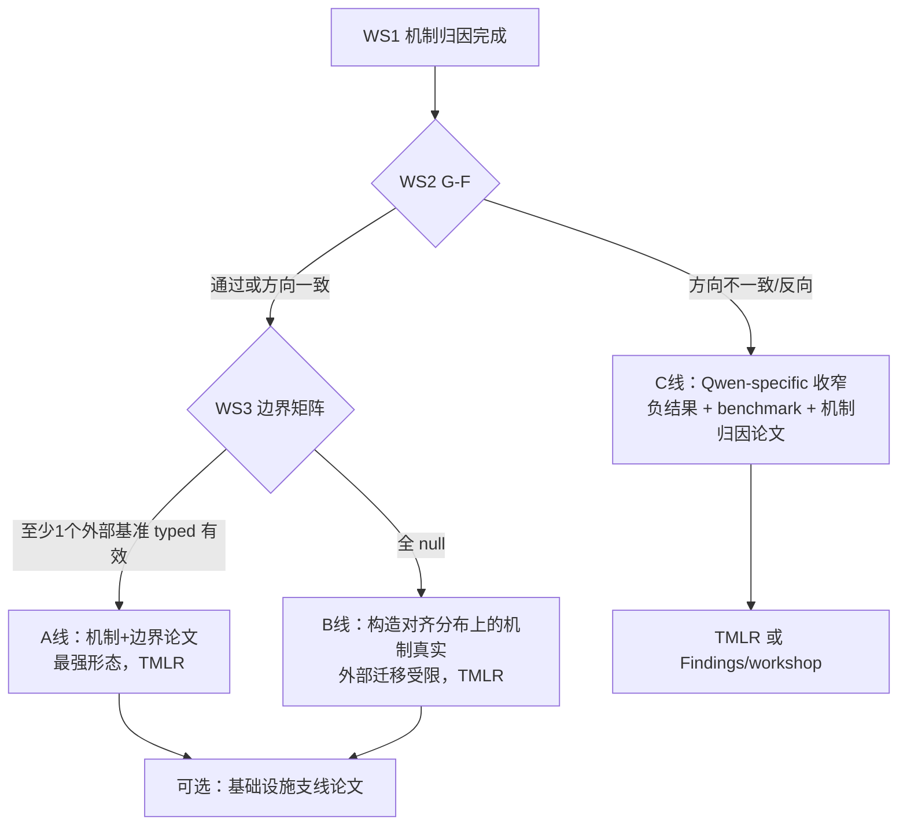

# FAR 长期优化路线企划书（Post-Stop-Rule Roadmap）

- 状态：**注册版 v1（2026-07-06）**。活动指纹由
  `experiments/protocol_longterm.py::ROADMAP_ACTIVE_SHA256` 强制校验；注册后变更只允许
  走第 14 节的 `deviation:` 流程。
- 与既有文档的关系：
  - [PROJECT_PROPOSAL.md](../PROJECT_PROPOSAL.md) 是原始研究企划，其"端到端优势 + AAAI-27 严格档"目标已被证据部分否定；
  - [PLAN_2PLUS4.md](PLAN_2PLUS4.md) 的经验分支已按预注册停止规则闭合（两轮 G-A 失败），本文档**不重开该分支、不推翻任何已冻结判定**；
  - 本文档回答的问题是：**停止规则触发之后，这个项目剩余的科学价值在哪里、按什么顺序变现、投到哪里去。**
- 单作者、零 API 预算、家用 GPU（Windows D: 盘 Ollama）约束继续成立。

---

## 执行摘要

项目现存一条幸存的正主张（Qwen dev 上 typed-vs-untyped +0.078）、一组高质量的失败证据（RAMDocs 两轮 G-A 失败及其错误分析）、一套已验证的三家族本地模型资产，以及一套超出常规研究仓库水准的预注册/fail-closed 证据基础设施。本企划将资源重新配置为六个工作流：

| 工作流 | 核心问题 | 模型调用 | 优先级 |
|---|---|---|---|
| WS1 机制归因 | RAMDocs 为什么失败？dev 的 +0.078 由哪个组件贡献？ | **零** | P0 |
| WS2 跨家族复现 | typed-vs-untyped 是 Qwen 特性还是机制？ | 本地 GPU | P0 |
| WS3 外部边界测绘 | typed conflict control 在哪类分布上有效？ | 本地 GPU | P1 |
| WS4 论文与投稿重定位 | 降级后的论文投向哪里、以什么形态？ | 无 | P0 |
| WS5 统计与实验设计升级 | 未来协议如何避免再次出现无检测力的门禁？ | 无 | P1 |
| WS6 工程与仓库长期维护 | 证据包体积、目录收敛、CI 滚动 | 无 | P2 |

**12 个月北极星**：一篇经同行评审的"机制 + 适用边界"论文（TMLR 或同级）+ 公开可复现证据包；可选支线为一篇单作者可信研究基础设施的 workshop 论文。AAAI-27 严格档不销毁但不再投入资源（见 6.4）。

**总纲**：从"证明 FAR 端到端更好"转向"精确刻画 typed conflict control 何时有用、何时无用、为什么"。前者已被 RAMDocs 证据关闭，后者是现有证据实际支持、且审稿人无法用一个 null 结果击倒的研究纲领。

---

## 0. 冻结的事实基线

本企划的一切设计都以下列已冻结事实为出发点。任何后续步骤不得改写它们。

| # | 事实 | 证据位置 |
|---|---|---|
| F1 | Qwen3.5 9B、60 条 dev、机器审计标签上：typed − untyped 答案正确率 **+0.078**、冲突 F1 **+0.420**、修订准确率 **+0.217**；确认层（35 条）与争议层（25 条）方向一致 | [reports/solo_paper_readiness.md](../reports/solo_paper_readiness.md) |
| F2 | 负消融：去掉反驳查询或边界查询**不降低**答案正确率；去掉 typed revision **提高**答案正确率并消除修订行为 | 同上（论文强制披露项） |
| F3 | RAMDocs dev Round 1：FAR 与最强基线 multi_query_rag 均为 0.3114，配对差 0，CI [-0.0286, 0.0314]，McNemar p=1.0，G-A 失败 | [diagnostics/ramdocs_v1](https://github.com/xiaweiyi713/FAR/tree/artifacts-v1/diagnostics/ramdocs_v1) |
| F4 | Round 2（只改最终答案合并层）：FAR 0.3086 vs 冻结基线 0.3114，配对差 -0.0029，CI [-0.0314, 0.0286]，McNemar p=1.0，第二次 G-A 失败 → **停止规则激活，2+4 降级为适用边界分析** | [diagnostics/ramdocs_v2](https://github.com/xiaweiyi713/FAR/tree/artifacts-v1/diagnostics/ramdocs_v2) |
| F5 | Round 2 错误分析：both_correct 93 / far_only 15 / baseline_only 16 / **both_incorrect 226**；gold coverage FAR 0.7467、基线 0.7457；unsupported sentences **0.9971 / 0.9933**；ambiguity_misinformation 类 166 条中 133 条双错 | [diagnostics/ramdocs_v2/round2/error_analysis](https://github.com/xiaweiyi713/FAR/tree/artifacts-v1/diagnostics/ramdocs_v2/round2/error_analysis) |
| F6 | FEVER 二分类迁移诊断：准确率 0.72、召回偏低，`publication_ready_main_result=false` | [diagnostics/fever_binary_v1](https://github.com/xiaweiyi713/FAR/tree/artifacts-v1/diagnostics/fever_binary_v1) |
| F7 | FalsiRAG-Bench：300 条五类均衡候选，counter-evidence recall 0.91；机器审计确认 178 / 争议 122；split 为 dev 60 / train 182 / test_inputs 58，**held-out 从未评测** | [bench/](../bench)、[reports/project_status_snapshot.md](../reports/project_status_snapshot.md) |
| F8 | 严格 AAAI 档 8 项阻塞（human_annotation、external_blind_returns 等）在单作者零预算下不可满足 | [reports/project_status_snapshot.md](../reports/project_status_snapshot.md) |
| F9 | 三家族本地模型已完成 Phase 0 smoke 并冻结 digest：`mistral:7b-instruct`、`gemma2:9b`、`llama3.1:8b`；记录含 `benchmark_data_accessed:false` | [diagnostics/model_smoke_2plus4](https://github.com/xiaweiyi713/FAR/tree/artifacts-v1/diagnostics/model_smoke_2plus4) |
| F10 | 家族配置已存在 `mistral_open.yaml`、`gemma_open.yaml`（llama 尚无 open 配置）；正式栈（vera_hybrid 检索 + NLI）配置齐备 | [experiments/configs/](../experiments/configs) |

从 F1–F5 可以读出本企划的核心判断：**RAMDocs 上两方法 64.6% 共同失败、逐句支持率≈0、gold coverage 只有 0.75，瓶颈在冲突层上游；typed conflict control 从未获得被检验的机会**。这既是失败的解释假设，也是可以被 WS1 证伪的命题。

---

## 1. 总体战略

三个支柱，对应"幸存主张做实、失败做深、证据体系变现"：

1. **做实**（WS2 + WS5）：幸存主张目前是"单模型、60 条、机器审计标签"。跨家族复现是把它从 Qwen 逸事升级为机制主张的最便宜路径——模型已 smoke、配置已大半存在、成本为 0 API + 若干 GPU 天。
2. **做深**（WS1 + WS3）：RAMDocs null 结果本身没有解释力，"适用边界分析"若只是并列数字就是免责声明。用零模型调用的冻结预测重分析 + 少量外部基准测绘，把边界变成**有机制解释、可证伪预测的论点**。
3. **变现**（WS4 + WS6）：严格 AAAI 档不可达是结构性事实，不是努力问题。改道到接受严谨负/边界结果的场所（TMLR 主线），并把预注册/fail-closed 基础设施本身作为可选的独立贡献。

继承的不可协商原则：预注册先于运行；fail-closed 门禁；主张边界逐字维护（机器审计 ≠ 真人金标，跨家族 ≠ 盲测）；`bench/splits/test_inputs.jsonl` 与 RAMDocs test 默认永久锁定。

---

## 2. WS1 机制归因（P0，零模型调用）

### 2.1 目标

用已冻结的预测和运行清单做确定性重分析，回答两个问题：

- **Q1（外部）**：RAMDocs 上 typed conflict control 失效的主导原因是什么？
- **Q2（内部）**：dev 上 +0.078 的答案正确率增益由哪个组件贡献？

零模型调用、零新数据、不碰任何 test。这是全企划性价比最高的一步：它直接决定降级后论文的中心论点。

### 2.2 预注册假设（分析代码冻结先于查看结果）

WS1 遵循 **analysis-before-look 规则**：先提交分类器/分析代码与下列假设的判定标准，再对数据运行。

| 假设 | 内容 | 预注册预测 | 证伪条件 |
|---|---|---|---|
| H-upstream | RAMDocs 失败主导因素是检索覆盖与多答案集合构造，冲突层未获机会 | 在 gold coverage 完整的子集上，FAR vs 基线配对差仍≈0 → 边界比预想更紧；若 FAR 显著为正 → 支持 H-upstream | 完整覆盖子集样本过少（<80）时判定降级为描述性 |
| H-conflict-shape | RAMDocs 冲突是 misinformation/noise 型，与 FAR 类型分类学（来源可靠性/范围/粒度/实体）不对齐，typed 检出率系统性低于 dev | FAR 在 RAMDocs 上的冲突类型检出分布与 dev 分布显著不同，且检出冲突的样本子集上修订行为无正效应 | 检出分布相近且检出子集上仍无效应 |
| H-metric | strict EM 的全对全错判分掩盖部分集合改进 | 宽松口径（集合 F1）下配对差仍不显著 → 排除该假设 | **仅描述性诊断**：口径变更不得作为任何新门禁判定（forking path 红线） |
| H-component | dev 的 +0.078 由 typed conflict **detection** 贡献，typed **revision** 以答案正确率换取修订行为（与 F2 一致） | 逐样本翻转分析中，正确率增益集中于"冲突被检出且未触发激进修订"的样本 | 增益集中于修订路径样本 |

#### 2.2.1 注册后的机器判定规则

为消除运行后解释自由度，WS1 v1 固定以下规则：

1. **分析冻结**：首次读取正式 WS1 输入前，`PLAN_LONGTERM_OPTIMIZATION.md`、
   `experiments/protocol_longterm.py`、`experiments/attribution.py`、
   `experiments/evidence_attribution.py` 与对应单测必须存在于一个已推送 Git 提交。
   构建器要求显式传入该提交，并验证当前四个实现文件与该提交逐字节一致；结果 manifest
   同时记录提交和文件 SHA-256。
2. **六桶按最早失败阶段唯一归类**（优先级从高到低）：
   `retrieval_miss` = FAR `evidence_ids` 未命中该题任何 `document_type=correct` 文档；
   `conflict_undetected` = 已命中正确文档、题目含 misinformation、但 FAR 未输出任何
   `predicted_conflict_types`；`conflict_detected_revision_wrong` = 已检出冲突且
   `revision_trace` 至少一项 `changed=true`，最终仍错；其余按
   `answer_set_incomplete`（gold phrase coverage < 1）、`answer_set_overfull`
   （命中任一 upstream wrong phrase）、`format_em_mismatch`（前述均不满足但冻结 exact
   仍为 0）依次归类。最后一桶也是评分不变量的报警桶，非零时报告必须醒目标注。
3. **检索分层**：按 FAR 对 `document_type=correct` 文档的 ID recall 精确分为
   `none`（0）、`partial`（0–1）与 `complete`（1）；冲突分层按 FAR 是否输出任一冲突
   精确分为 `detected` / `not_detected`。两套分层都必须各自覆盖完整 350 条。
4. **H-metric 口径**：对每题先按冻结 RAMDocs normalizer 判断每个 gold/wrong phrase 是否
   被答案包含；集合 precision = `gold_hits / (gold_hits + wrong_hits)`（分母为 0 时为 0），
   recall = `gold_hits / gold_count`，报告其调和平均。它只做描述性配对 bootstrap，绝不
   参与或重开 G-A。
5. **假设状态**只允许 `supported` / `not_supported` / `indeterminate`：
   H-upstream 在 complete-retrieval 子集少于 80 条时不可判定；否则仅当 FAR−baseline
   exact 差为正且 bootstrap 95% CI 下界 > 0 时支持。H-conflict-shape 在任一域检出冲突
   少于 20 条时不可判定；否则仅当两域冲突类型总变差距离 ≥0.20、RAMDocs 检出率至少比
   dev 低 0.15、且 RAMDocs detected 子集 FAR−baseline exact 差 ≤0 时支持。H-metric
   仅当集合 F1 配对差为正且 95% CI 下界 >0 时支持。H-component 在 FAR 相对 untyped
   的正向逐样本增益少于 5 条时不可判定；否则仅当其中“已检出冲突且无
   `revision_trace.changed`”样本严格多于“发生 changed revision”样本时支持。
6. **dev 翻转定义**：答案分数 ≥0.8 记为样本正确，用于五臂 binary flip matrix；同时
   保留原始连续 `answer_correctness` 差。`machine_confirmed` / `machine_disputed` 分层是
   强制披露，不改变任何假设状态。

### 2.3 任务分解

| 任务 | 内容 | 产出 | 工时 |
|---|---|---|---|
| WS1-0 | 冻结分析代码：`experiments/attribution.py`（确定性、输入为冻结制品 SHA），单测覆盖分类规则 | 模块 + 测试 | 2 天 |
| WS1-A | RAMDocs both_incorrect 226 条失败桶分类：`retrieval_miss` / `answer_set_incomplete` / `answer_set_overfull` / `format_em_mismatch` / `conflict_undetected` / `conflict_detected_revision_wrong`，每条恰好一个主桶（优先级顺序判定） | 逐条 JSONL + 汇总表 | 2 天 |
| WS1-B | 条件配对分析：按 gold coverage 分层、按冲突检出分层的 FAR vs 基线配对差 + bootstrap CI（检验 H-upstream / H-conflict-shape） | 分层分析表 | 1 天 |
| WS1-C | H-metric 描述性重算：冻结预测的集合 F1 / partial credit 口径 | 描述性表（明确标注非门禁） | 0.5 天 |
| WS1-D | dev 组件归因：FAR / minus_typed_conflict / minus_typed_revision / minus 反驳 / minus 边界 五臂的逐样本翻转矩阵，定位 +0.078 的样本来源与组件路径（检验 H-component） | 组件归因表 + 论文段落草稿 | 2 天 |
| WS1-E | 产出**适用前提清单**（applicability preconditions）：typed conflict control 生效所需的可检验前提（如"冲突证据可检索且属于结构化类型"，对照 F7 的 counter-evidence recall 0.91 vs F5 的 gold coverage 0.75） | `reports/mechanism_attribution.md` | 1 天 |

### 2.4 门禁 G-R1

WS1 无成败判定（它是归因不是验证），但设**完整性门禁 G-R1**：226 条每条有且仅有一个主桶；分层分析覆盖全部 350 条；四个假设各有明确"支持/不支持/不可判定"结论并写入报告。验证器 `experiments.evidence_attribution verify` fail-closed。

### 2.5 红线

不调用任何模型；不读取 `bench/splits/test_inputs.jsonl` 或 RAMDocs test；不以 H-metric 的宽松口径重开 G-A 或宣称"其实赢了"；结论表述始终带"机器审计、dev、单模型、非盲测"限定。

---

## 3. WS2 跨家族 dev 复现（P0）

### 3.1 动机

幸存主张的最大弱点是"单模型"。三个非 Qwen 家族模型已完成 smoke（F9），配置大半存在（F10），复现成本约为若干 GPU 天 + 0 API 成本。结果无论正反都改变论文成色：复现 → 机制主张；不复现 → 主张收窄为 Qwen-specific，且必须在投稿前知道。

### 3.2 设计

- **数据**：`bench/splits/dev.jsonl` 全部 60 条。train/test_inputs 不动。
- **方法臂**：主对比仅两臂——FAR（typed）与 `minus_typed_conflict`（untyped）。可选扩展臂 vanilla_rag、multi_query_rag 仅作上下文，不参与判定。
- **家族**：Mistral `mistral:7b-instruct`、Google `gemma2:9b`、Meta `llama3.1:8b`，绑定 F9 已冻结的 Ollama digest。DeepSeek（API）列为可选第 4 家族，默认不跑（违反零预算约束）。
- **配置**：复用 `mistral_open.yaml`、`gemma_open.yaml`；新增 `llama_open.yaml`（除模型字段外与前两者同构）；检索/NLI 栈与 Qwen dev 完全一致，禁止逐家族调参。
- **运行纪律**：沿用 2+4 的 run identity 机制（干净 commit、配置 SHA、Ollama digest、checkpoint 可续跑）；每家族先跑 5 条校准 smoke 估算总时长，再跑正式 60 条。

### 3.3 预注册判定（门禁 G-F）

在任何正式运行前注册：

- **唯一主指标**：答案正确率（机器审计标签口径，与 F1 相同）的 typed − untyped 配对差。冲突 F1、修订准确率为次级描述性指标，**不参与判定**。
- **主判定**：三家族合并 180 个配对观察的分层检验（按家族分层的精确 McNemar + 按家族聚类的 bootstrap 合并配对差 CI）。G-F 通过 ⇔ 合并配对差 > 0 且分层 McNemar p < 0.05（双侧）。
- **辅助判定（不改变 G-F，仅决定表述强度）**：逐家族方向一致性。≥2/3 家族方向为正 → 论文可写"方向上跨家族一致"；否则必须逐家族披露。
- **分层敏感性**：确认层（机器审计确认标签）单独重算一遍，作为强制披露，不作判定。
- **功效前置（门禁 G-P，见 WS5）**：运行前用 Qwen dev 观察到的不一致对率做模拟功效分析并写入预注册附录。若合并设计对 +0.078 量级效应的功效 < 0.6，必须在附录中明示"本设计以方向复现为目标，不承诺显著性"，并相应弱化 G-F 失败时的解读。

### 3.4 止损与解读规则

| 结果 | 处置 |
|---|---|
| G-F 通过且 ≥2/3 家族方向为正 | 主张升级为"四家族 dev 机制证据"（仍带机器审计/dev/非盲测限定） |
| G-F 未通过但方向一致 | 主张保持单模型显著 + 跨家族方向性；论文如实写功效限制 |
| 方向不一致或反向 | 主张收窄为 Qwen-specific，WS4 论文形态切换到 C 线（见第 7 节）；**不允许**换指标、换子集、加家族重判 |

一次注册一次运行；不设 Round 2。任何偏离走 `deviation:` 提交。

### 3.5 制品与验证

`diagnostics/family_dev_v1/`（三家族 × 两臂运行清单、预测 SHA、判定 JSON），独立验证器 `experiments.evidence_family_dev verify` fail-closed；执行手册补 Windows D: 运行与 rsync 回传步骤。预计净工时 4–6 天 + GPU 挂机若干天。

---

## 4. WS3 外部冲突基准边界测绘（P1）

### 4.1 动机

对 dev 正结果最自然的审稿人攻击是 **construct-method coupling**：FalsiRAG-Bench 的标签构造规则与 FAR 类型分类学同源。RAMDocs null 会放大质疑。单点 null 无法定位边界；在 2–3 个冲突形态各异的外部基准上做小规模 dev 诊断，把"何时有效"变成经验矩阵。

### 4.2 WS3-0：候选核查（先做，3–5 天）

候选池（均为带上游标签的公开冲突/矛盾基准，**可用性、许可、规模、标签形态需逐一核查后再注册**）：

| 候选 | 冲突形态 | 对 FAR 的预期匹配度 |
|---|---|---|
| ConflictBank | 大规模构造型证据冲突 | 高（结构化冲突，接近 FAR 分类学） |
| WikiContradict | 人工标注的维基矛盾对 | 高（真实矛盾、人工标签） |
| FaithEval（inconsistent / counterfactual 子集） | 上下文不一致与反事实 | 中 |
| ClashEval | 参数知识 vs 检索内容冲突 | 中（冲突在模型内外之间） |

核查产出选型备忘录，**至多选 3 个**。下载走国内镜像（如 hf-mirror）并按仓库惯例钉死修订与 SHA-256。

### 4.3 设计与预注册（门禁 G-B）

- 每基准 dev 规模 100–200 条（按 G-P 功效模拟定），分层随机抽样并冻结抽样种子；原基准如有官方 test 一律不触。
- 双对照：FAR vs 该基准上最强适配基线（端到端）；typed vs untyped（机制）。主判定只挂机制对比，端到端为描述性。
- 模型：Qwen3.5 9B 单模型（控制变量、控制成本）；若 WS2 已通过 G-F，可选加一个家族做稳健性。
- **预注册假设网格**：基于 WS1-E 的适用前提清单，对每个基准先写"预期有效/无效及理由"（例：冲突可检索性高 + 结构化冲突 → 预期有效）。这使测绘成为可证伪的机制检验，而不是在基准间钓鱼直到出现正结果。
- G-B 无全局通过/失败：产出是**边界矩阵**（基准特征 × typed 效应方向与 CI）+ 预测对照表（预注册预期 vs 实际）。
- 多重比较：跨基准的机制对比统一做 Holm 校正后报告。

### 4.4 止损

至多 3 个基准、每基准至多一次正式运行。全 null → 边界结论为"typed conflict control 的已证实增益目前仅限构造对齐分布"，进入 WS4 的 C 线；这仍是可发表的诚实结论。

### 4.5 制品

`bench/external/<name>_v1/` 导入器 + verify（复刻 `build_ramdocs` 模式）、`diagnostics/boundary_v1/`、`reports/boundary_matrix.md`。预计净工时 8–12 天 + GPU 挂机。

---

## 5. WS4 论文与投稿重定位（P0）

### 5.1 主线：TMLR

理由：TMLR 按"主张与证据是否匹配"评审而非 novelty-impact 门槛，明确接受严谨的负结果与边界结果；滚动投稿无 deadline 压力，适配单人兼职节奏；对长附录（证据链、预注册文档、偏离日志）友好——这个项目最大的差异化资产恰好是证据链完整性。

### 5.2 论文中心论点（随 WS1–3 结果落定）

不变的骨架：

1. 贡献一：typed conflict control 机制及其组件归因（WS1-D 把 F2 的负消融从免责声明重写为"效应位于 detection 而非 revision"的结构性结论）；
2. 贡献二：FalsiRAG-Bench + 机器审计标注协议（如实标注非真人金标）；
3. 贡献三：**适用边界**——dev 正结果、RAMDocs 双 null 的机制归因（WS1-A/B/C）、外部测绘矩阵（WS3）、跨家族证据（WS2），合成一张"何时用 typed conflict control"的前提条件表。

RAMDocs 失败在论文中的角色从"被降级的验证"翻转为"边界证据"：两轮预注册失败 + 停止规则执行本身是可信度卖点，正文明写。

### 5.3 支线：基础设施论文（可选，P2）

单作者可信研究的预注册/fail-closed 门禁/SHA 谱系/停止规则执行记录，作为 4–8 页 workshop 论文（reproducibility / meta-science / trustworthy-NLP 方向），素材几乎已在 `docs/` 与 `diagnostics/` 中。仅在主线投出后启动。

### 5.4 AAAI-27 严格档处置

**明确决定：不再向严格档投入资源。** 严格档文档、`submission/evidence.template.json` 与全部 fail-closed 工具保留不动，作为未来出现两名独立标注者或外部保管方时的升级路径。本决定写入 `README` 状态表述即可，不需要新工具。

### 5.5 held-out 政策

`bench/splits/test_inputs.jsonl`（58 条）与 RAMDocs test 默认**永久锁定**。唯一解锁条件：论文进入终稿且审稿明确要求确证性评测，且新预注册通过 G-P 功效门禁（58 条对本项目效应量几乎必然功效不足，预期结论是"不解锁"——这句话本身写入论文限制节）。解锁只能经 `falsirag-one-shot` 一次性通道。

### 5.6 工时

论文重写（中心论点翻转 + 三个工作流结果并入）约 3–4 周净工时，依赖 WS1/WS2 完成、WS3 至少完成 WS3-0 + 1 个基准。

---

## 6. WS5 统计与实验设计升级（P1）

RAMDocs 的教训之一是门禁无检测力：350 条、CI 半宽 ±0.03，G-A 天然探测不到 3pp 以下效应；dev 的 +0.078 建立在 60 条（净 4.7 条）上。升级项：

| 任务 | 内容 | 产出 |
|---|---|---|
| WS5-A | `experiments/power.py`：给定配对不一致率与效应量，模拟 McNemar / 分层 McNemar / 聚类 bootstrap 的功效曲线 | 模块 + 单测 |
| WS5-B | 历史功效回顾：用 Qwen dev 与 RAMDocs 两轮的实际不一致率，回算当时门禁的可检测效应下限，写入论文限制节与 [EXPERIMENT_PLAN.md](EXPERIMENT_PLAN.md) | `reports/power_retrospective.md` |
| WS5-C | **门禁 G-P 制度化**：今后任何新预注册（含 WS2/WS3）必须附功效模拟；功效 < 0.6 的设计必须显式降格为方向性/描述性研究 | 预注册模板更新 |

工时约 3 天，先于 WS2 正式注册完成。

---

## 7. 结果组合决策树

三条线都以同一批冻结证据为底座，区别只在主张强度；**没有任何结果组合导致"无可发表产出"**——这是本路线相对于继续冲击端到端优势的根本优势。

---

## 8. 阶段规划与时间线（单人兼职）

| 阶段 | 周 | 内容 | 出口判据 |
|---|---|---|---|
| R0 | 1–2 | 注册本企划 SHA；WS5-A/B/C；WS1 全部（含 G-R1）；WS6-0 体积核查 | `reports/mechanism_attribution.md` 通过 G-R1；功效工具可用 |
| R1 | 3–5 | WS2：预注册附录（G-F+G-P）→ `llama_open.yaml` + 校准 smoke → 三家族正式运行 → 冻结与判定 | `diagnostics/family_dev_v1` verify 通过，G-F 判定落盘 |
| R2 | 6–9 | WS3：WS3-0 选型 → ≤3 基准导入+verify → 预注册假设网格 → 运行与冻结 → 边界矩阵 | `reports/boundary_matrix.md` 完成 |
| R3 | 10–14 | WS4：论文按 A/B/C 线重写 → 内部 readiness 门禁 → TMLR 投稿；arXiv 同步 | 投稿回执 |
| 长期 | 15+ | 审稿响应；基础设施支线论文（可选）；WS6 例行维护 | — |

R1 与 R2 的 GPU 挂机可与文书工作并行；关键依赖是 WS1→WS4（中心论点）与 WS5→WS2/WS3（功效前置）。总日历时间约 3.5–4 个月至投稿，含缓冲。

---

## 9. WS6 工程与仓库长期维护（P2）

现状健康（fail-closed 门禁下沉、协议指纹谱系、run identity、158 个测试、四版本 CI），只列维护项：

| 任务 | 内容 |
|---|---|
| WS6-0 | 核查 `diagnostics/` 实际体积（当前占 tracked 文件 208/419）。超过约 200MB 时把历史证据包迁移到 GitHub Release assets，in-tree 只留 manifest + SHA-256；或启用 git-lfs |
| WS6-1 | 收敛 `output/` 与 `outputs/` 为单一目录，归档旧内容，更新 `.gitignore` 与文档引用 |
| WS6-2 | 新增制品一律配独立 verifier + 单测（延续现行惯例，写入贡献约定） |
| WS6-3 | CI Python 矩阵滚动（3.10 EOL 前评估收窄）；uv.lock 每季度例行更新一次并跑全量测试 |
| WS6-4 | `docs/` 交叉引用死链检查纳入 CI（企划文档增多后易腐） |

---

## 10. 风险登记册

| 风险 | 概率 | 影响 | 缓解 |
|---|---|---|---|
| WS2 不复现（方向不一致） | 中 | 主张收窄为 Qwen-specific | C 线论文预案；投稿前知情优于被审稿人发现 |
| WS2/WS3 功效不足，结果模糊 | 中高 | 结论只能是方向性的 | G-P 前置；预注册中明示目标级别，避免过度解读 |
| 外部基准许可/可得性不符 | 中 | WS3 候选减少 | 候选池 4 选 3；WS3-0 先核查再注册 |
| 家用 GPU 故障/被占用 | 中 | 时间线拉长 | checkpoint 可续跑已验证（Round 2 恢复记录）；无硬 deadline 的 TMLR 主线天然兼容 |
| 多重比较膨胀 | 中 | 可信度受损 | 唯一主指标 + Holm 校正 + 一次注册一次运行 |
| dev 反复查看导致的自我欺骗 | 中 | 归因结论不可信 | WS1 analysis-before-look：分类器代码与假设先冻结提交 |
| TMLR 拒稿 | 中 | 延迟 | Findings / workshop 降级路径；证据包独立于场所存在 |
| 单人时间膨胀 | 高 | 全线延迟 | 每阶段出口判据即 kill criteria；R2 可整体砍掉（B/C 线仍成立） |

---

## 11. 明确不做的声明（红线）

1. 不重开 RAMDocs dev Round 3；停止规则为终局。
2. 不访问 `bench/splits/test_inputs.jsonl` 与 RAMDocs test，除非满足 5.5 节全部条件并另行预注册。
3. 不把机器审计标签、LLM 陪审团或作者仲裁表述为真人金标 / human IAA；不把跨家族复现表述为盲测或外部验证。
4. 不用 H-metric 宽松口径、子集选择或指标替换追溯性改写任何已冻结判定。
5. 不在未注册预注册附录（含 G-P 功效模拟）的情况下开始任何新的正式对比运行。
6. 不因 WS3 某基准出现正结果而在论文中弱化 RAMDocs 双失败的呈现。

---

## 12. 新增制品清单

| 制品 | 路径 | 验证 |
|---|---|---|
| 本企划书（注册后含 SHA） | `docs/PLAN_LONGTERM_OPTIMIZATION.md` | 指纹常量 `ROADMAP_ACTIVE_SHA256` |
| 归因分析模块与证据包 | `experiments/attribution.py`、`diagnostics/attribution_v1/` | `experiments.evidence_attribution verify`（G-R1） |
| 机制归因报告 | `reports/mechanism_attribution.md` | 随证据包指纹 |
| 功效工具与回顾 | `experiments/power.py`、`reports/power_retrospective.md` | 单测 |
| WS2 预注册附录 | `docs/PLAN_FAMILY_DEV.md` | 独立 SHA，绑定 F9 digest |
| 跨家族证据包 | `experiments/configs/llama_open.yaml`、`diagnostics/family_dev_v1/` | `experiments.evidence_family_dev verify`（G-F） |
| WS3 选型备忘录与预注册 | `docs/PLAN_BOUNDARY_MAPPING.md` | 独立 SHA |
| 外部基准导入与边界证据包 | `bench/external/<name>_v1/`、`diagnostics/boundary_v1/`、`reports/boundary_matrix.md` | 各自 build/verify（G-B） |

---

## 13. 资源与预算

- **API 成本**：0（全部本地 Ollama；DeepSeek 第 4 家族为可选项，默认不启用）。
- **GPU**：WS2 约 360 次 pipeline 运行（2 臂 × 60 条 × 3 家族）；WS3 上限约 900–1200 次（2 臂 × ≤200 条 × ≤3 基准）。均以 5 条校准 smoke 实测单条耗时后再排期，参照 Round 2 的 systemd + checkpoint + watchdog 基建挂机。
- **人力**：净工时约 25–35 天，日历 3.5–4 个月（兼职）。

## 14. 注册与偏离规则

- 本文档注册方式与 [PLAN_2PLUS4.md](PLAN_2PLUS4.md) 相同：定稿后计算 SHA-256 写入新常量 `ROADMAP_ACTIVE_SHA256`，与 `PROTOCOL_PHASE_A_SHA256` / `PROTOCOL_ACTIVE_SHA256` 谱系相互独立，互不改写。
- WS2 / WS3 的正式运行各自要求独立预注册附录（第 12 节），注册前运行无效。
- 任何注册后的变更走 `deviation:` 提交并同步写入 [DEVELOPMENT_LOG.md](DEVELOPMENT_LOG.md)，规则与 2+4 第 7 节一致；证据冻结后的偏离不再允许。
- 本文档本身的修订在注册前自由进行，注册即冻结。
